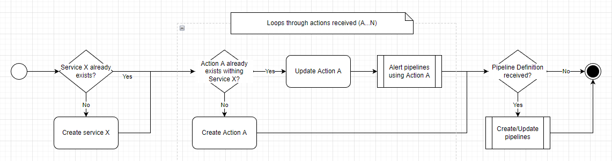

# Pipeliner Server

Pipeliner is a distributed pipeline execution service that enables arrangements of actions into pipelines 
respecting inputs and outputs of actions in distributed services.

The idea is that everything runs resiliently between the HTTP protocol, and scales nicely with the use of
queues to invoke actions on the remote servers.

### **I'm still thinking everything through, so chill.** 

## Diagrams

#### Action Creation Flow

